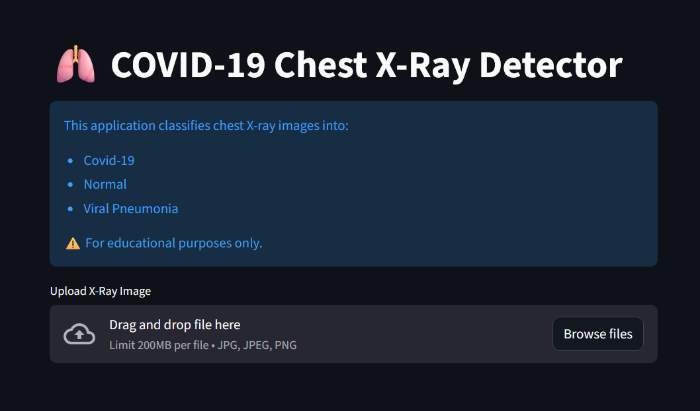
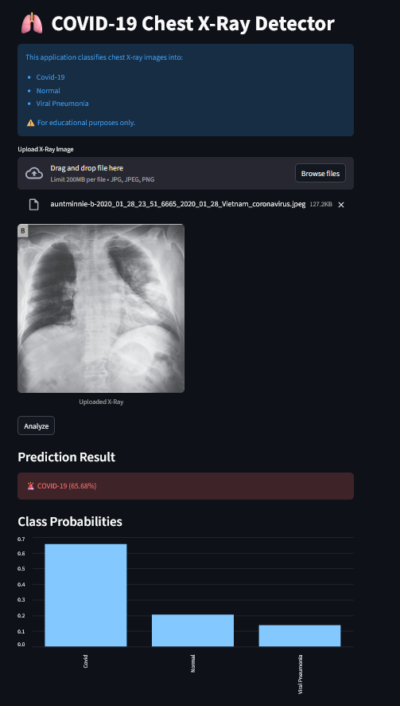

---

# 🫁 ChestXRay-COVID-CNN

**CNN-Based Chest X-ray Classification for COVID-19 Detection**

ChestXRay-COVID-CNN is a deep learning project that classifies chest X-ray images into multiple respiratory conditions (e.g., **COVID-19, Pneumonia, Normal**) using a custom Convolutional Neural Network (CNN) built with **TensorFlow/Keras**.

The project demonstrates a **complete medical image classification pipeline**, including data preprocessing, augmentation, model training, evaluation, and an interactive web app for real-time inference.

---

## 📌 Project Highlights

* ✅ End-to-end CNN pipeline (no shortcuts)
* ✅ **Interactive Streamlit Web App** for user-friendly testing
* ✅ Proper train / validation / test split
* ✅ Data augmentation for better generalization
* ✅ Regularization using Dropout & EarlyStopping
* ✅ Medical-focused evaluation (confusion matrix & class-wise metrics)
* ✅ GPU-accelerated training support

---

## 🧠 Model Architecture

The model is a custom CNN designed for small-to-medium medical imaging datasets.

```
Input (128 × 128 × 3)
↓
Data Augmentation
↓
Conv2D (32) + MaxPooling
↓
Conv2D (64) + MaxPooling
↓
Conv2D (128) + MaxPooling
↓
Global Average Pooling
↓
Dense (64) + Dropout (0.5)
↓
Softmax (3 classes)

```

**Why this design?**

* Uses **GlobalAveragePooling** to reduce overfitting
* Balanced depth to avoid excessive model capacity
* Optimized for medical image generalization

---

## 📂 Dataset

* **Source:** Kaggle – COVID-19 Chest X-ray Dataset
* **Classes:**
* COVID-19
* Pneumonia
* Normal


**Directory structure:**

```
Covid19-dataset/
├── train/
│   ├── COVID/
│   ├── Pneumonia/
│   └── Normal/
└── test/
    ├── COVID/
    ├── Pneumonia/
    └── Normal/

```

---

## ⚙️ Tech Stack

* **Python 3.12**
* **TensorFlow / Keras**
* **Streamlit** (Web Interface)
* NumPy, Pandas
* Matplotlib, Seaborn
* scikit-learn
* OpenCV

---

## 🚀 Training Strategy

* **Loss:** `sparse_categorical_crossentropy`
* **Optimizer:** Adam
* **Metrics:** Accuracy (+ Recall during experiments)
* **Callbacks:**
* EarlyStopping (monitoring validation loss)


* **Input pipeline:**
* Caching
* Shuffling
* Prefetching for performance


---

## 📊 Evaluation

The model is evaluated on a **held-out test set** using:

* Confusion Matrix
* Classification Report (Precision, Recall, F1-score)
* Accuracy & Loss curves

Medical datasets often suffer from class imbalance, so **recall and F1-score** are emphasized over accuracy alone.

---

## 📈 Results (Sample)

* Training Accuracy: ~88–90%
* Validation Accuracy: ~70–75%
* Model shows expected overfitting behavior for small medical datasets
* EarlyStopping used to restore best-performing weights

> ⚠️ In medical AI, **generalization and recall are more important than raw accuracy**

---

## 🖥️ Streamlit App Screenshots

The project includes a user-friendly web interface where users can upload an X-ray image and get an instant classification with confidence scores.

### 1. Home Page & Image Upload



### 2. Prediction Results



---

## 🛠️ How to Run

### 1️⃣ Clone the repository

```bash
git clone https://github.com/vishalgupta-git/ChestXRay-COVID-CNN.git
cd ChestXRay-COVID-CNN

```

### 2️⃣ Install dependencies

```bash
pip install -r requirements.txt

```

### 3️⃣ Train the model

> ⚠️ **Note:** The training pipeline is currently implemented in the Jupyter Notebook  
> `notebook.ipynb`. A dedicated `train.py` script will be added in a future update.

To train the model (future script):

```bash
python train.py
```

### 4️⃣ Run the Web App

To launch the Streamlit interface:

```bash
streamlit run app.py

```

---

## 📌 Future Improvements

* 🔄 Transfer Learning (EfficientNet / MobileNet)
* ⚖️ Class-weighted training
* 📉 ROC-AUC (multi-class)
* 🧪 Cross-validation
* 🏥 Improved recall for COVID-positive cases

---

## 📜 Disclaimer

This project is intended **for educational and research purposes only**.
It is **not a certified medical diagnostic tool** and should not be used for clinical decision-making.

---

## 👤 Author

**Vishal Gupta**
AI / Deep Learning Enthusiast

If you find this project useful, ⭐ the repository!

---